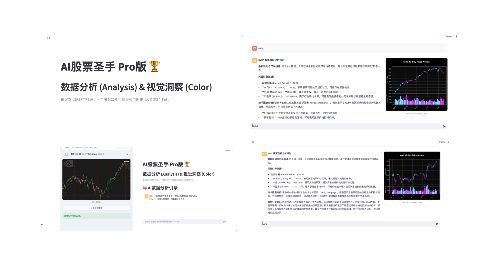

Markdown

# AI股票圣手 Pro

> 一款融合量化数据与交易员视觉“盘感”的AI投资分析代理 (Agent)。

本项目为参加 **2025 NVIDIA AI 黑客马拉松** 而创建。

---

## 目录
- [项目简介](#项目简介)
- [主要功能](#主要功能)
- [成果展示](#成果展示)
- [技术栈](#技术栈)
- [主要API与数据源](#主要api与数据源)
- [安装与启动](#安装与启动)
- [项目成员](#项目成员)
- [致谢](#致谢)
- [许可证](#许可证)

---

## 📖 项目简介

### 背景

本项目源于一次餐桌对话：一位拥有20年实战经验的职业投资人父亲，在向他15岁、充满创意的女儿展示复杂的金融模型时，女儿却提出了一个更直观的问题——“AI能否‘看懂’图表颜色的感觉？” 这个瞬间的火花，催生了我们解决一个核心痛点的想法：**如何将冰冷的量化分析与交易员直觉化的视觉“盘感”相结合**。为此，我们最终打造了一个融合数据分析与视觉洞察的双引擎AI投资助手：“AI股票圣手 Pro”。

### 目标

我们的目标是开发一个具备高级决策能力的AI股票投资代理 (Agent)，它能够：

* **模拟** 资深投资人结合图表形态和交易数据的“盘感”直觉。
* **输出** 清晰、可解释的投资建议和判断依据。
* **降低** 专业金融分析的门槛，为广大个人投资者提供普惠化、易于使用的专业级决策支持工具。

### 实现方式

为实现上述目标，我们构建了一个基于多模态信息融合的AI系统。其核心实现方式如下：

1.  **双模态输入：** 系统同时接收两种类型的数据：
    * **视觉数据：** 股票的K线图、成交量柱状图等图像信息。
    * **时序数据：** 历史价格、成交量、市盈率等结构化量化指标。

2.  **双引擎分析：** 我们设计了两个并行的分析引擎：
    * **视觉分析引擎：** 利用经典的 **ResNet-50** 模型（通过 `torchvision.models` 加载）来识别图表中的特定模式（如头肩顶、金叉死叉等），捕捉交易员的视觉“盘感”。
    * **量化分析引擎：** 利用 **LSTM (长短期记忆网络)** 模型对时序数据进行深度分析，挖掘价格趋势和市场情绪。

3.  **智能代理决策：** 一个核心的智能代理 (Agent) 会整合来自上述两个引擎的分析结果，进行最终的综合判断，并生成投资建议。整个系统被封装在一个统一的Web应用中，方便用户交互。

---

## ✨ 主要功能

* **智能图表形态识别 (Visual Pattern Recognition):**
    利用 ResNet-50 模型自动分析股票的K线图，精准识别如头肩底、金叉死叉、上升三法等多种经典技术形态。

* **未来趋势量化预测 (Quantitative Trend Prediction):**
    基于 LSTM 模型深度分析历史价格与成交量数据，对股票未来N日的涨跌趋势做出量化预测。

* **一键生成综合分析报告 (One-Click Analysis Report):**
    融合视觉形态识别与量化趋势预测两大引擎的分析结果，为用户一键生成包含图表解读、数据洞察和明确趋势判断的综合性投资分析报告。

---

## 📸 成果展示

下面是“AI股票圣手 Pro”的核心界面截图，展示了我们的双引擎分析结果。



如果想了解我们项目的详细技术报告和成果分析，请点击下方链接下载PDF报告。

### 📄 [点击这里，下载我们的项目报告 (PDF)](./docs/ai_stock_report.pdf)

---

## 🛠️ 技术栈

* **NVIDIA 技术:**
    * `NVIDIA NeMo`: 用于构建和运行项目的核心生成式AI能力，特别是实现了RAG（检索增强生成）流程。

* **核心AI框架:**
    * `PyTorch`: 用于加载 `ResNet-50` 模型并进行图像分析。
    * `Scikit-learn`: 用于数据预处理和可能的机器学习模型评估。

* **后端 / Web应用框架:**
    * `Streamlit`: 用于快速构建和部署交互式Web用户界面。

* **数据处理与可视化:**
    * `Pandas`: 用于处理和分析结构化的金融时间序列数据。
    * `NumPy`: 用于进行高性能的科学计算和数值运算。
    * `Matplotlib / Seaborn`: 用于生成报告中的各种数据图表。
    * `OpenCV`: 用于图像（K线图）的预处理。

---

## 🌐 主要API与数据源

* **Yahoo Finance API (`yfinance`):**
    * 作为主要的量化数据来源，提供股票的历史价格、成交量等核心市场数据。

* **Tavily API:**
    * 作为RAG流程中的检索引擎，用于从网络上获取最新的金融新闻、分析文章等信息，为AI决策提供实时上下文。

---

## 🚀 安装与启动

请严格按照以下步骤操作，以确保项目能够成功运行。

### 1. 克隆代码仓库
```bash
git clone [https://github.com/Aymc88/nvidia_hackathon_project-1.git](https://github.com/Aymc88/nvidia_hackathon_project-1.git)
cd nvidia_hackathon_project-1
2. 创建并激活Conda环境
强烈建议使用 Conda 来管理项目环境，以避免与其他项目的库产生冲突。

Bash

# 创建一个名为 hackathon_env 的新环境
conda create -n hackathon_env python=3.10 -y

# 激活环境
conda activate hackathon_env
3. 安装所有依赖库
在激活的环境中，使用项目根目录下的 requirements.txt 文件来安装所有必需的库。

Bash

pip install -r requirements.txt
4. 配置API密钥
本项目需要使用 Tavily API 等服务。

访问相关服务网站（如 Tavily AI）申请 API 密钥。

在项目的根目录下，创建一个名为 .env 的新文件。

打开 .env 文件，在里面粘贴以下内容，并将 '...' 替换为你申请到的真实密钥：

TAVILY_API_KEY='粘贴你申请到的Tavily密钥'
NVIDIA_API_KEY='粘贴你申请到的NVIDIA密钥'
OPENAI_API_KEY='粘贴你申请到的OpenAI密钥'
5. 启动Streamlit应用
一切准备就绪！运行以下命令来启动Web应用：

Bash

streamlit run main_app.py
启动后，在浏览器中打开终端显示的本地网址 (通常是 http://localhost:8501) 即可开始使用。

👥 项目成员
姓名	                 角色	               GitHub
Wilson Chen	分析代理开发 (Analysis Agent Dev)	@Wii8369
Amanda Chen	色彩代理开发 (Color Agent Dev)	    @Aymc88

Export to Sheets

🙏 致谢
感谢 NVIDIA AI 黑客马拉松 提供了这次宝贵的学习和创造机会。

感谢所有为本项目提供数据和灵感的开源社区。

⚖️ 许可证 (License)
This project is licensed under the MIT License.